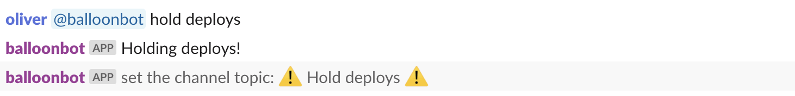
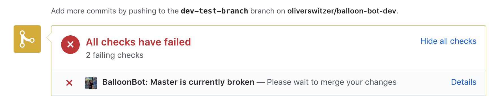
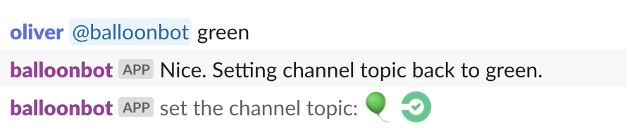
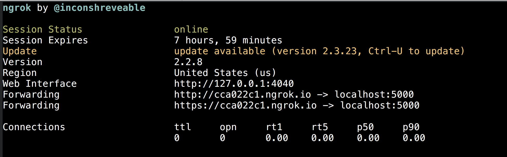
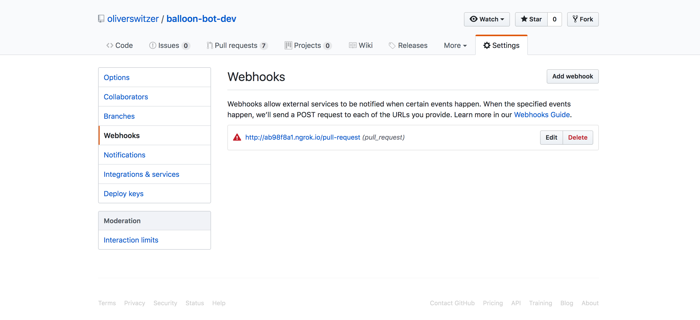

# Balloon Bot

This Slack bot is meant to help let engineers in your organization know when master is broken. It also will help gather information for post-mortems.

# How it works

1. When something breaks, tell balloon bot!



2. Balloon bot will set the channel topic


3. As well as make sure to set failing github statuses on all open pull requests



4. When you've fixed the issue, tell balloon bot and all will continue as if nothing ever happened.



# Development

To run the bot locally, you first must setup your API token. 

1. Create a `.env` file that looks like `.env.sample` and fill it out
1. Install foreman `gem install foreman`
1. Run the app with `foreman start` or `bundle exec rake server` in the root directory

### Creating and running migrations

#### Postgres database setup

**Install postgres**

`$ brew install postgresql`
`$ brew services start postgresql`

#### Create the balloonbot database

`$ cd web && bundle exec rake db:create`

**To create a new migration**

From the top-level of the directory (not `web`), run:

`$ bundle exec rake db:generate:migration[<name of migration>]`

e.g.

`$ bundle exec rake db:generate:migration[CreateUsersTable]`

This will output the migration into `persistence/lib/migrations/20190406001400_create_users_table.rb` (not `web/db/migrate`)

**To run migrations**

From the top-level of the directory, run:

`$ bundle exec rake db:migrate`

All migrations in `persistence/lib/migrations` will be run.

**For any other Rails rake task feel free to run these in the `web/` directory**

### Webhook behavior

If you'd like to test the webhook functionality with Github locally (marking new PRs as failing when there's an incident), you will need to use ngrok.

* `gem install ngrok`
* Start ngrok 

`nkgrok http 5000` 

foreman automatically chooses port 5000 for now. Output in terminal should look like this: 



* Under the configured github repo's settings, add a webhook to point at the app
 


* Select "Add webhook"

* Enter the ngrok Forwarding url (http://cca022c1.ngrok.io in the example):

`http://cca022c1.ngrok.io/pull-request`

* Select "Let me select individual events"
* Uncheck "Pushes" and check "Pull requests"
* Click "Add Webhook"
* The app running locally should now respond to incoming github webhooks!

Note that you'll have to update this webhook in the future if you run ngrok again, since you get assigned a new `Forwarding` url each time you run ngrok. It's a bit unfortunate, but part of development :/

# Running tests

1. Create a `.env.test` file. 
- The credentials entered here will be used to run integration tests against `Clients::Github::GithubClientWrapper` on a test repo
specified by the `GITHUB_REPO` env var. 
    - Note that two specific branches must exist in this repo for these tests to succeed, as indicated by the constants
    `TEST_BRANCH_1` and `TEST_BRANCH_2` in the spec.
    - It is recommended to use a separate github repo than what you use for local development
    to avoid possible data conflicts from simultaneous test runs 

1. `bundle exec rake test`

# Deployments

1. `git push heroku master`
2. If there are migrations

```bash
$ herkoku run rake db:migrate
```

To stop the app:

`$ heroku ps:scale web=0`

To start it back up again:

`$ heroku ps:scale web=1`
